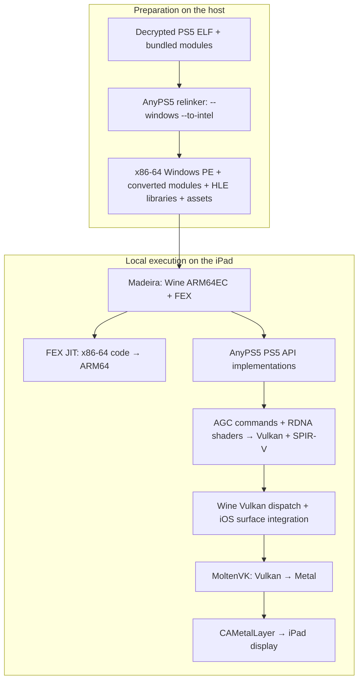

# madeira-anyps5

**Run relinked PS5 games locally on an iPad using AnyPS5, Madeira, Wine, FEX, and MoltenVK.**

AnyPS5 converts a decrypted PS5 executable ahead of time into an **x86-64 Windows PE** and supplies implementations of the PS5 APIs it uses. Madeira runs that Windows program on Apple Silicon: **Wine provides Windows services, FEX translates x86-64 CPU instructions to ARM64, and graphics follow Vulkan → MoltenVK → Metal**.

This repository contains the patches, build scripts, preparation tools, and device probes that connect those components. The app retains Madeira's library, settings, JIT setup, and touch controller. Games execute on the iPad; a PS5 or remote PC is not involved during play.

**Dreaming Sarah's PS5 build has reached touch-controlled gameplay on an iPad Air 13-inch M2.** Controlled 15in1 Solitaire runs display Golf's full board, draw from the stock and perform a legal tableau move with the underlying card exposed. Solitaire's speed, audio, complete gameplay, saves and lifecycle still need qualification. This is an experimental compatibility stack with a limited tested library. See [device results](#device-results) for the distinction between gameplay observations, component tests, and the latest app build.

Runtime profiling is opt-in; the overlays distinguish Vulkan-reported presentation timing from accepted submissions. The runtime requests three swapchain images where supported, with a two-image comparison switch. See [runtime performance and measurement](docs/RUNTIME-PERFORMANCE.md) for switches, local tests and optimized host builds. A successful app build does not establish a speedup; matched physical-device measurements remain required.

## Execution architecture

There are two separate stages. Relinking happens before launch; CPU translation happens while the game runs.



### 1. AnyPS5: executable conversion and PS5 APIs

The input is the game's decrypted ELF executable and its bundled modules, rather than its source code or a PC version. The relinker writes a Windows PE with startup and dynamic-linking machinery, converts bundled modules, and checks the executable for unsupported syscall use. `--to-intel` rewrites supported AMD-specific instructions into a form suitable for the downstream x86-64 execution path. It does **not** compile the game into native ARM64 code.

PS5 system calls and library interfaces are handled by AnyPS5's replacement libraries, including `libkernel`, `libSceAgcDriver`, `libSceVideoOut`, `libScePad`, and the audio, user, dialog, and save APIs needed by the tested title. These are high-level API implementations, not PS5 firmware. Libraries with a `.prx` extension in the Windows runtime are host-built implementations; their filename alone does not make them original console binaries.

The PE wrapper does not change every guest function into a conventional Win64 function: the game retains PS5/SysV calling conventions. The relinker startup code, generated trampolines, and HLE builds must agree on those boundaries, thread-local storage, and exception unwinding.

PS5 imports identify functions through NIDs. The preparation tools NID-patch fresh HLE libraries and check the resulting import/export graph, including converted guest modules and Windows DLL dependencies. Resolving an import proves that a provider exists; it does not prove that every behavior required by a game is implemented.

Converted guest modules can retain their own exported functions and state alongside an HLE replacement. Their guest constructors must run when those exports remain reachable; loading the replacement alone does not initialize the guest module. Patch0045 applies this lifecycle policy consistently to Windows and Linux conversion. A freshly relinked Solitaire package now passes its previously failing guest-library startup and reaches Vulkan on the iPad. [Lifecycle implementation tests](docs/evidence/retained-guest-export-lifecycle-20261008.json), [fresh device startup](docs/evidence/ipad-solitaire-retained-export-lifecycle-20261008.json).

The locally built HLE set contains 50 PRX implementations. Solitaire resolves its 47 explicit HLE dependencies; corrected startup and controlled menu/game-entry evidence remain distinct from that audit and from full gameplay acceptance. [Local HLE builds](docs/LOCAL-HLE-BUILD.md) can also select all available PRX targets. The added [Unity-facing API coverage](docs/HLE-API-COVERAGE.md) includes functional local APIs and explicit offline/unsupported service paths. This is not an exhaustive PS5 API implementation or a compatibility guarantee for arbitrary games. See [AnyPS5's relinker usage](https://github.com/boykopovar/AnyPS5/blob/df16c4c256be3c44e03eb9149a6ce5f8e8a038b2/docs/user/USAGE.md) and this repository's [game preparation guide](docs/PRIVATE-GAME-PACKAGING.md).

### 2. Wine and FEX: Windows services and CPU translation

Wine's ARM64EC runtime handles Windows executable loading, threading, files, exceptions, and virtual-memory APIs. FEX's `xtajit64.dll` translates the x86-64 guest code into ARM64 at runtime. These are complementary responsibilities: Wine supplies the operating-system interface; FEX supplies execution of the foreign CPU instructions.

The iOS build has two kinds of runtime components:

- **Windows PE modules**, including `xtajit64.dll`, `winevulkan.dll`, and `vulkan-1.dll`, packaged for Wine.
- **Native iPhoneOS static libraries**, containing Wine's Unix-side services and FEX support, linked into the app's Mach-O executable. Madeira's binder registers the Unix call tables instead of relying on desktop-style loading of Unix `.so` modules.

AVX/AVX2 support must be enabled in the actual `xtajit64` execution path before initialization with `MADEIRA_FEX_AVX=1`. Changing only Madeira's separate in-process FEX bridge is insufficient. On the tested Apple Silicon CPU, FEX lowers the relevant vector operations using its 128-bit host path; this does not require native 256-bit AVX or SVE hardware.

Ordinary protected-page faults also require CPU-state preservation: the optional paired native/libc bridge retains AVX upper halves and x86 flags across write-watch handling. Its independent iPad tests include handler edits and nested faults. See [exception and memory contracts](docs/EXCEPTION-MEMORY-CONTRACTS.md) for the protocol, opt-in switches, and limits.

The build verifies the packaged ARM64EC PE components with [check-ios-pe.py](scripts/check-ios-pe.py). Required runtime libraries are real implementations, not empty archives used to make the linker succeed.

### 3. Graphics: PS5 commands to Metal

AnyPS5's graphics libraries interpret the game's AGC command stream, maintain GPU resources, and recompile RDNA shaders to SPIR-V. Their Vulkan calls cross this boundary:

```text
AnyPS5 libSceAgcDriver / libSceVideoOut
  → vulkan-1.dll → winevulkan.dll
  → registered iOS winevulkan Unix call table / win32u driver
  → statically linked MoltenVK
  → Metal command buffers and CAMetalLayer
```

The window path remains **SDL window → HWND → Wine surface → CAMetalLayer**. Wine translates the Win32 surface request into the Metal surface used by MoltenVK. The project does not replace VideoOut with a separate native Metal renderer, and this graphics path does not use Madeira's DXMT/D3D renderer.

The iOS integration builds `libwinevulkan_unix.a`, registers its dispatch table in Madeira's binder, and retains the statically linked MoltenVK entry points. The loader resolves Vulkan functions through valid dispatch entry points rather than passing an internal placeholder handle to ordinary `dlsym`.

The patches also handle Vulkan portability enumeration and enable the portability subset when advertised. Device capability checks remain meaningful: a successful Vulkan instance alone does not prove that shader execution, buffer device addresses, 8-bit storage, or BC textures work on the target iPad.

Two shader changes were necessary for the tested M2/MoltenVK path:

- **Invariant masked-shift folding:** prove that particular lane-query expressions are invariant, then remove their unnecessary subgroup operations. This addresses vertex-stage subgroup instructions that the device cannot support.
- **Validated fixed-function interpolation:** recognize supported RDNA interpolation sequences and emit a fixed-function equivalent, avoiding the unsupported barycentric path. `APS5_FIXED_FUNCTION_INTERPOLATION=1` explicitly selects this compatibility path; unrecognized sequences are rejected rather than silently approximated.

Game render targets, the SDL window, the Vulkan swapchain, and the Metal layer are separate dimensions. Dreaming Sarah diagnostics recorded **1280 × 720 game textures with a 768 × 432 swapchain**. A separate synthetic demo exercised a full 1280 × 720 surface. These results must not be conflated into a claim of native 720p output for every game run.

For Solitaire's eight-sample targets, the experimental renderer retains eight logical samples as two native four-sample image layers. Patches0040–0044 connect guest sample positions, per-group pipelines, RGBA8/S8 transfers and sampled shader routing, behind the default-off `APS5_ENABLE_SAMPLE_GROUPS` switch. Independent production-transfer probes pass exact color and stencil readback on the M2 iPad. Earlier game runs rejected internal rectangle stages, fixed-function resolve state and then an opaque SPIR-V type. The later 0048/0049 packages clear those logged rejections. The short baseline stays white; controlled paths produce blue output or an early green background. Later controlled runs display the full selection menu and Golf board, with visible stock-card changes and a legal Q♠ onto K♣ move exposing 5♦. Complete gameplay and sustained performance remain unqualified.

Patch0046 adds exact factory-provenance checks for internal rectangle stages while retaining the original guest shaders' write restrictions and mandatory fault checks. Patch0047 recognizes a restricted GC10 fixed-function color resolve and averages 2/4/8 logical samples into a single-sample RGBA8 target using the actual rectangle geometry. An independent iPad pipeline with the production resolve fragment and generated rectangle stages passes six full/partial-geometry cases, including native Vulkan resolve comparisons at 2/4 samples. Non-tie values and untouched destination pixels match exactly; half-rounding ties permit one UNORM unit. This probe does not execute the complete guest renderer.

The latest locally verified 63-patch AnyPS5 source series applies and reverses across 158 checked paths. Its rebuilt package contains 50 PRX implementations and three runtime DLLs; 22 CPU/API suites plus actual write-tracking, resource-classification and full Graphics suites pass under desktop Wine. Patches0057/0058 add separate, default-off GPU tiling conversions for qualified RGBA8 and S8 sample layouts. They retain the original tiled seed, changed-byte guest commit and fence per grouped draw. Patch0059 reuses immutable stencil transfer programs through a bounded per-device cache; per-draw buffers, 64 bitplane raster draws and synchronization remain. Patch0060 can replace those stencil transfers with a stencil-only clear on each draw when the entire D32S8 tiled snapshot, including padding, is zero and the admitted operations provably preserve zero. It retains both four-sample groups, color and depth behavior, the existing fence, and guest-memory tracking; other states retain the general transfer. This experiment is enabled only by exact `APS5_ZERO_STENCIL_INVARIANT=1`. Native GPU byte/padding checks and the complete HLE build pass; these checks do not qualify iPad gameplay or speed. Controlled device packages start with normal memory tracking and a 768 × 432 three-image swapchain. Z-consuming draws, sampled depth, compressed metadata, EQAA and unsupported shader effects remain rejected. See [MSAA implementation and qualification](docs/MSAA-EMULATION.md), [0057 GPU color source/build qualification](docs/evidence/gpu-color-sample-tiling-build-20261009.json), [0058 GPU stencil source/build qualification](docs/evidence/gpu-stencil-sample-tiling-build-20261009.json), [0059 stencil program cache qualification](docs/evidence/stencil-transfer-program-cache-build-20261009.json), [0060 zero-stencil source/build qualification](docs/evidence/zero-stencil-invariant-build-20261009.json), [the preserved as-built 0044 checkpoint](docs/evidence/solitaire-msaa-draw-source-20261008.json), [0054–0056 source and build qualification](docs/evidence/resolve-snapshot-depth-copy-build-20261009.json), [0053 source and build qualification](docs/evidence/scoped-bulk-driver-writes-build-20261008.json), [0046 static checks](docs/evidence/grouped-msaa-canonical-rectlist-20261008.json) and [independent resolve probe](docs/evidence/ipad-fixed-color-resolve-20261008.json).

Patch0061 adds a separate, default-off color snapshot seed: exact `APS5_GPU_COLOR_SAMPLE_STAGING_COPY=1` reads guest memory directly into an immutable coherent baseline and seeds the output buffer with a full GPU copy, preserving tiled padding, fences and changed-byte alias commits. It removes one additional 66,846,720-byte CPU copy for the tested eight-sample layout. Its full rebuild and host suites pass. A 720-second iPad run exercises the path and verifies stock draw, undo and selection; two A attempts leave the tableau unchanged. No legal move, speed gain or audio acceptance is qualified for this experiment. The last native footprint is 4,304 MiB, and the new pooled baseline can remain allocated after use. [Focused qualification](docs/evidence/color-sample-staging-copy-native-20261009.json), [build checkpoint](docs/evidence/color-sample-staging-copy-build-20261009.json), [separate device result](docs/evidence/ipad-solitaire-color-sample-staging-copy-controls-20261009.json).

Patch0062 adds a bounded, default-off legacy AudioOut diagnostic. It fingerprints guest input before processing and the converted bytes immediately before SDL enqueue, with separate frame ordinals and per-channel results. It preserves the existing processing and queue paths; diagnostic overhead remains unmeasured, and the repeated tone is not fixed. Patch0063 adds a separately gated eight-sample color tiler: one invocation computes the pixel address once, then transfers all eight samples. Two/four-sample and disabled paths retain the original shader. The complete rebuild and host suites pass. Native byte/padding comparisons pass; an isolated Mac GPU conversion chain measures 11.72 ms versus 2.88 ms. This is not an iPad speed or FPS result. A separate enabled iPad run verifies Golf selection and its full board; the freshly generated native cache contains the expected converted Metal variant. Raw shader dumps remain absent, and the experiment stays default-off without an accepted speed or audio improvement. [Enabled device checkpoint](docs/evidence/ipad-solitaire-pixel-owned-controls-20261009.json), [Audio diagnostic scope](docs/evidence/audioout-ingress-trace-focused-20261009.json), [pixel tiler qualification](docs/evidence/color-sample-pixel-owned-native-20261009.json), [combined build checkpoint](docs/evidence/pixel-owned-and-audio-ingress-build-20261009.json).

Patch0048 repairs that inspector's handling of opaque SPIR-V image/sampler types. It validates descriptor kind, image shape and fixed-array count against the recompiler metadata; missing types, mismatched descriptors and unsupported combined globals remain errors. Ten accepted and 56 rejected synthetic cases pass sanitizer checks, and the subsequent game run clears the previous logged type rejection. That earlier checkpoint does not qualify correct displayed game frames. See [opaque descriptor validation](docs/evidence/opaque-descriptor-shader-validation-20261008.json) and [bounded device result](docs/evidence/ipad-solitaire-opaque-descriptor-20261008.json).

Patch0049 adds default-off bounded statistics over existing producer and resolve-source transfers. Its baseline run observes a sampled MSAA write and matching resolve-source values while the selected scaled output stays white. Short same-binary controls produce blue or an early green background; copied-target readbacks have matching resolve/display logical colors after RGBA/BGRA decoding. Extending the transition-only control reveals new draw patterns after about 131 seconds and a full menu in the selected source by 163.19 seconds, also visible on the physical iPad at the nominal 180-second capture. This is a menu-frame observation. A matched long baseline is still needed to separate duration from the transition switch; interaction, gameplay, a default repair and FPS remain unproved. See [baseline diagnostics](docs/evidence/ipad-solitaire-bounded-pixel-diagnostics-20261008.json), [short controls](docs/evidence/ipad-solitaire-resident-path-controls-20261008.json) and [long menu checkpoint](docs/evidence/ipad-solitaire-transition-menu-20261008.json).

Patch0050 is a separate default-off descriptor experiment: `APS5_EXPLICIT_DRAW_DESCRIPTORS=1` replays owned initial bindings before the existing read-only snapshot overrides. Native metadata checks and the full rebuild pass, but the device logs a real replay and still shows white in five scaled captures and the nominal 180-second screenshot. No fix is accepted and defaults remain unchanged. Native Mach `UNHANDLED` markers occur in both long experiments; later activity follows them, so absence of fatal markers does not mean an exception-free run. [Negative experiment and limits](docs/evidence/ipad-solitaire-explicit-descriptor-experiment-20261008.json).

Patch0051 separately tests closing each recorded draw pass while retaining GENERAL layouts, snapshots and asynchronous batches. `APS5_CLOSE_DRAW_PASS=1` is exercised on the iPad, but all five scaled source captures and the nominal 180-second screenshot remain white. It stays default-off. [Negative draw-pass experiment](docs/evidence/ipad-solitaire-close-draw-pass-experiment-20261008.json).

Patch0052 dispatches once per color Tile/Detile surface to literal-size copies for 1/2/4/8/16-byte texels, removing imported variable-size `memcpy` calls from the optimized inner loops. Independent layout/sanitizer checks and the full HLE/host rebuild pass. On the controlled transition path, the first recorded menu source arrives at 115.08 seconds, compared with the earlier 163.19-second observation; these diagnostic counters are not a matched FPS benchmark. A synchronized landscape input test then visibly changes the menu with Right and enters Golf with A. The physical iPad shows dealing followed by seven columns of five cards, stock/waste and a selection highlight. **Menu input and game entry are observed; individual card actions, a complete game, audio, saves, background recovery and sustained FPS remain unqualified.** All runtime files and metadata restore. [First device comparison](docs/evidence/ipad-solitaire-inline-color-texel-menu-20261008.json), [interactive game-entry checkpoint](docs/evidence/ipad-solitaire-inline-color-texel-input-20261008.json). The earlier 49-patch input attempt remains a separate [orientation-unqualified record](docs/evidence/ipad-solitaire-transition-menu-input-20261008.json).

Patch0053 adds an opt-in full-copy path: exact `APS5_BULK_DRIVER_WRITES=1` scopes stores of at least 16 KiB only when a retained lease covers the destination with registered readable/writable mappings. Sparse and no-op `WriteChanged` retain their existing path. A real Windows shared-memory fixture preserves bytes, aliases and driver/CPU stamps while reducing handled faults during its full copy from four to zero. The complete rebuild and host suites pass; a hardware gain is not yet qualified. The transactional HostWrite counter/protection rollback and mapping-identity repairs also apply to existing callers with the bulk option off. Concurrent foreign CPU-write attribution during an own-store callback remains an inherited unqualified case. [0053 source/build scope and limits](docs/evidence/scoped-bulk-driver-writes-build-20261008.json).

The separate 53-patch iPad run exercises one scoped 66,846,720-byte copy, enters Golf after the menu input sequence and shows a real stock action: after Y, the waste changes from K♥ to 10♣ while the tableau remains visible. At nominal 420 seconds the new waste card persists and the slow game timer reads `00:10`. All 56 runtime files and metadata restore. This qualifies one stock response, with tableau moves, a complete game, audio, saves and sustained FPS still unqualified. Its earlier menu source and higher trace counts are diagnostic progress, not a speed claim; the unconditional API repairs also differ from 52, so attributing a bulk-specific improvement needs a matched 53 run with the option off. [Controlled device checkpoint](docs/evidence/ipad-solitaire-scoped-bulk-driver-writes-20261008.json).

Patches0054–0056 add three focused CPU-cost candidates. Exact `APS5_CACHE_COLOR_RESOLVE_PIPELINES=1` admits only the internal fixed-function resolve shaders to a pipeline cache keyed by their complete generated SPIR-V. Exact `APS5_RAW_RESOLVE_SNAPSHOT=1` captures the qualified multisample source as owned tiled bytes, avoiding its CPU detile/retile cycle while retaining range checks, pending-write flushes and snapshot ownership. Both options remain off by default. Supported depth/stencil layouts always use literal-size raw texel copies after patch0056; their address equations and padding rules are unchanged. The full 56-patch HLE rebuild and host suites pass. These source/build results establish neither a device speed gain nor additional gameplay. [Combined source/build record](docs/evidence/resolve-snapshot-depth-copy-build-20261009.json), [pipeline-cache native checks](docs/evidence/color-resolve-pipeline-cache-native-20261009.json).

### 4. Guest memory and coherency

AnyPS5's original guest arena spans 448 GiB starting at an 8 GiB virtual address. An iPad's extended virtual-address entitlement does not make an equally large contiguous range available: Madeira, Wine, FEX, JIT aliases, and native mappings already occupy parts of the process address space.

The tested M2 configuration instead uses a **4 GiB virtual window at 464–468 GiB**, reserved lazily in **256 MiB chunks**. This is an address-space reservation policy, not an allocation of 4 GiB of physical RAM at startup.

The allocator accounts for existing host mappings and excludes conflicting chunks. A failed multi-chunk reservation rolls back newly acquired placeholders; a failed rollback is reported. Fixed-address conflicts are diagnosed rather than hidden by relocating mappings behind the guest's back.

Wine-side fixes preserve Windows placeholder replacement, shared 16 KiB mappings, protection changes, and write-watch behavior on iOS. Guest data mappings are distinguished from executable allocations so ordinary game memory does not exhaust FEX's JIT alias pool. PS5 memory uses 16 KiB pages, but Windows still exposes its own page and allocation-granularity semantics; matching the native page size alone is insufficient.

AnyPS5 tracks CPU writes to GPU-visible memory through page protection and dirty tracking. Native fault handling repairs the relevant writes while preserving shared aliases and subsequent GPU synchronization. Consecutive-fault diagnostics distinguish a stuck repeated fault from a long sequence of legitimate handled writes.

### 5. Input, JIT, and app lifecycle

Touch input follows **Madeira touch controller → XInput → SDL controller → `scePad`**. The app retains its 18-control layout. Early reservation of the virtual controller slot is available for titles that initialize SDL before the first touch; otherwise the game can miss the controller even while the native overlay responds.

JIT is required for FEX. Madeira retains its StikDebug and built-in StikJIT paths. The verified build-17 configuration uses **Settings → JIT method → Built-in StikJIT**, a pairing record stored in the app's Keychain, and an active LocalDevVPN connection. The helper enables debugging, prepares the JIT pool, and detaches before Wine starts. Automatic selection may choose an installed external helper, so the selected method and tunnel state matter.

The app needs a development signature and a provisioning profile that actually grants debugging, increased memory, and extended virtual addressing. Adding entitlement keys to the app without corresponding profile grants is insufficient.

The Vulkan lifecycle patch stops admitting new work when the app becomes inactive and drains submitted GPU work before suspension. A brief background/resume cycle has been observed to recover; long cycles remain a separate compatibility check. Audio runs through the AnyPS5/Wine runtime; music has been heard during gameplay, but complete audio behavior and save/load still need qualification.

## How this differs from Magnus

[MagnusPS5](https://github.com/BaconMakin/MagnusPS5) describes itself as an ARM/iOS PS5 emulator based on KyTyPS5. Its [runtime linker](https://github.com/BaconMakin/MagnusPS5/blob/main/src/loader/runtimeLinker.cpp) loads ELF programs and resolves them inside the emulator.

**madeira-anyps5 takes the ahead-of-time relinking route:** AnyPS5 prepares an x86-64 Windows program first; that program then runs through Wine + FEX, with graphics through Vulkan → MoltenVK → Metal. Executable conversion, PS5 API compatibility, CPU translation, and graphics translation remain distinct layers. This architectural difference is not a claim that either project is faster or supports more games.

## Device results

Evidence currently covers an **iPad Air 13-inch M2 (`iPad14,10`), iPadOS 27.0.1**. It does not establish compatibility with other models or OS versions.

| Test | Observed result |
| --- | --- |
| Dreaming Sarah, PS5 version `01.000.000` | Publisher logo, title/options, new game, visible forest gameplay, walking/jumping, music, and NPC dialogue in a maintainer recording. A separate six-minute run verified held directional input. [Recording notes](docs/evidence/ipad-m2-dreaming-sarah-gameplay-recording.json), [directional-input run](docs/evidence/ipad-m2-dreaming-sarah-held-input.json). |
| Earlier menu app, `0.1.8 (17)`, 2026-10-07 | Locally signed and installed as `com.buberlo.anyps5ipad`; its own library launch enabled JIT and reached the title screen with 18 controls. Gameplay, audio, save/load, and background recovery were not requalified on this exact build. [Build record](docs/evidence/ipad-m2-menu-build17.json). |
| Earlier menu app, `0.1.9 (18)`, 2026-10-07 | Refreshed native/ARM64EC runtime signed and installed; built-in StikJIT enabled after LocalDevVPN connected. The WASAPI hardware period reports 21.333 ms. The existing library/configuration were preserved. [Build and installation record](docs/evidence/ipad-m2-menu-build18-solitaire-install.json). |
| Earlier menu app, `0.1.9 (19)`, 2026-10-08 | Signed and installed with the UIKit-to-Vulkan activation gate repaired. Existing library and configuration are byte-preserved. [Build 19 record](docs/evidence/ipad-m2-menu-build19-solitaire-startup.json). |
| Earlier menu app, `0.1.9 (22)`, 2026-10-08 | Signed and installed with corrected ARM64 atomic fault classification. An independent CPU probe on the iPad verifies atomic write faults and a plain-load read-fault control. Library/configuration restored after testing. [Build 21 CPU record](docs/evidence/ipad-m2-menu-build21-atomic-direction.json). Build 22 adds default-quiet FEX configuration diagnostics; paired ordering tests still fault in Solitaire. [Build 22 record](docs/evidence/solitaire-build22-context-and-ordering.json). |
| Earlier menu app, `0.1.9 (23)`, 2026-10-08 | Signed and installed with an optional live guest argument tracer. The synthetic iPad probe passes ten calls, 210 pointer checks and R12–R15 preservation checks. The game still faults in its graphics worker; this is diagnostic progress, not compatibility proof. [Build 23 record](docs/evidence/solitaire-build23-live-arguments.json). |
| Earlier menu app, `0.1.9 (25)`, 2026-10-08 | Signed and installed with an FEX arithmetic frontend repair and opt-in block diagnostics. An independent x86 probe completes 160 result/flag checks on the iPad, but process cleanup still faults. Solitaire reaches its entry point in bounded prototype tests and still faults in its graphics worker. Production game files and configuration are restored. **No visible gameplay is qualified.** [Build 25 record](docs/evidence/solitaire-build25-arithmetic-checkpoint.json). |
| Earlier menu app, `0.1.9 (26)`, 2026-10-08 | Signed and installed with a fix for FEX memory notifications during DLL teardown. An independent native CRT write-fault test passes 36 data/register checks and 68 protected-page faults; the arithmetic test passes 160 checks. Both now exit with code 0 and return to the library. The controlled Solitaire test still faults at the same graphics-worker instruction. Production files and configuration restored. **No visible gameplay is qualified.** [Build 26 record](docs/evidence/solitaire-build26-native-write-and-teardown.json). |
| Earlier menu app, `0.1.9 (28)`, 2026-10-08 | Signed and installed with per-compiler IR capture ownership and preservation of the 128-byte SysV red zone during guest exception delivery. The independent red-zone test changes from four failures to zero. A separate private write-watch test passes 768 byte/register/reset checks, including four concurrent writers, exits 0 and returns to the library. Solitaire still faults with its normal memory tracking. A bounded private test without private write watching avoids that fault for 60 seconds but shows only white output and rejected GPU draws. All regular game files and configuration are restored; this switch is not a production fix. **No visible gameplay is qualified.** [Build 28 record](docs/evidence/solitaire-build28-redzone-and-write-watch.json). |
| Earlier native menu app, `0.1.9 (47)`, earlier 0048 HLE checkpoint, 2026-10-08 | Official FEX-2610 plus the reconciled iOS port is built and installed; bounded device probes pass pending AVX, nested/cross-page protected stores, safe reads and 543 asynchronous deliveries with AVX. New MoltenVK passes the split-MSAA coverage prototype. The native process-name lifetime repair passes its sanitizer regression and two bounded GPU/library-return runs; executable-page pipe reads remain unqualified. The fresh 0048 HLE Solitaire package starts through built-in JIT and reaches the three-image Vulkan swapchain. Its closed log has no skipped-draw or `AGC graphics:` errors, but this earlier reviewed surface remains white with controls. The early-detach `Wine finished after 23.3s` message is followed by runtime activity and does not establish game exit. **This historical HLE checkpoint has no qualified correct game frames or 60 FPS.** [Native build/device results](docs/evidence/fex-2610-integration-20261008.json), [0048 game device/build record](docs/evidence/ipad-solitaire-opaque-descriptor-20261008.json). |
| Earlier menu app, `0.1.9 (42)`, 2026-10-08 | Signed and installed. The opt-in same-process read repair passes thirteen source-read cases with no errors or exception callbacks, including protected/decommitted pages and native 16-KiB boundaries. It retains Wine's logical protection checks; a kernel-only candidate failed those checks and was rejected. Low aliases and invalid destinations remain outside this probe's qualification. The paired CPU probe also passes 153 page-crossing cases, its original 192 cases plus 96 nested faults, a separate twelve-case read continuation, and 96 non-temporal store cases. An independent private test of the supplied copy function passes 208 cases and 302 handled write faults. These results do not identify the bad shader-packet writer. No gameplay is qualified. [Safe-read record](docs/evidence/ipad-safe-self-read-20261008.json), [page-crossing record](docs/evidence/ipad-cross-page-protected-stores-20261008.json), [non-temporal record](docs/evidence/ipad-non-temporal-protected-stores-20261008.json), [copy contract](docs/evidence/ipad-supplied-copy-contract-20261008.json), [contracts and limits](docs/EXCEPTION-MEMORY-CONTRACTS.md). |
| Paired CPU-state checkpoint, `0.1.9 (40)`, 2026-10-08 | Signed and installed. The paired native/libc bridge passes 192 scalar/vector protected-store cases, 96 nested faults and 864 rejected requests. The full guest-memory suite also passes 36 native CRT/shared-alias cases; asynchronous delivery passes all 553 AVX/integer-state cases. Compatibility switches remain default-off, and game files/configuration are restored. Interpolation guards and prior shader replay pass locally; these CPU results do not qualify gameplay. [Expanded vector-store record](docs/evidence/ipad-vector-protected-stores-20261008.json), [paired runtime record](docs/evidence/ipad-protected-store-state-20261008.json), [protocol and limits](docs/EXCEPTION-MEMORY-CONTRACTS.md). |
| Tested stencil-depth repair, 2026-10-08 | Host proof and captured metadata replay pass. The combined graphics candidate ran on iPad: normal memory tracking still faults; the diagnostic no-private-watch run stays white and reports 8-sample draw rejections. The actual M2 Vulkan attachment counts are only 1, 2 and 4. Production runtime, configuration and library restored. **No visible gameplay is qualified.** [Device pair](docs/evidence/solitaire-unobserved-stencil-depth.json), [GPU capability queries](docs/evidence/solitaire-ipad-msaa-capabilities.json). |
| Tested shader repair, 2026-10-08 | A conservative scalar-branch optimization removes one unnecessary vertex subgroup vote. Fourteen complete private shader replays pass SPIR-V validation; the combined graphics candidate no longer reports the earlier vertex vote or unused viewport-depth rejections in its diagnostic iPad run. Output is still white and audio is reported distorted. An independent special-APC test fails preemption on iPad. **No visible gameplay is qualified.** [Qualification record](docs/evidence/solitaire-uniform-vertex-branch.json). |
| 15in1 Solitaire, earlier 49-patch baseline, PS5 version `01.000.000` | Complete HLE dependency audit and hash-verified import. Interpolation and stencil-clear repairs reach a game-selection menu in the earlier Windows reference. Build 47 with the lifecycle-corrected relinker and 49 HLE patches starts through built-in JIT with normal memory tracking and a 768 × 432 three-image swapchain. Its bounded baseline observes a sampled MSAA write and matching resolve-source values, but the selected scaled output and reviewed surface stay white. No skipped draw, `AGC graphics:`, `bad_alloc` or `FATAL` is logged. **Correct iPad game frames, gameplay, audio and 60 FPS remain unqualified.** [Baseline device diagnostics](docs/evidence/ipad-solitaire-bounded-pixel-diagnostics-20261008.json), [independent resolve probe](docs/evidence/ipad-fixed-color-resolve-20261008.json), [MSAA implementation and scope](docs/MSAA-EMULATION.md). |
| Solitaire experimental path controls, 2026-10-08 | With the same 49-patch package, `APS5_NO_RESIDENT_TARGETS=1` and independently `APS5_SYNC_DRAWS=1` change three scaled captures from white to uniform blue; the sync-only run retains resident presentation. `APS5_DRAW_TRANSITIONS=1` shows an early opaque green radial background, then blue. Perturbing copied-target GPU readbacks match resolve/display logical colors over each full 1920 × 1080 target after channel-order decoding. Runtime/configuration/library rollback is verified. **These are diagnostic improvements in output, not a default repair, playable scene or FPS measurement.** [Controlled comparisons](docs/evidence/ipad-solitaire-resident-path-controls-20261008.json). |
| Solitaire long transition control, 2026-10-08 | The same 49-patch package with `APS5_DRAW_TRANSITIONS=1` reaches the full title/selection menu: the source capture at 163.19 seconds and physical screenshot at nominal 180 seconds show the title, Yukon/Canfield/Golf cards, buttons and background. Earlier source captures through 130.25 seconds stay blue; draw/resolve/present activity continues throughout. All 56 runtime files and metadata restore. **Visible menu confirmed; interaction, gameplay, audio, saves, FPS and a default-path repair remain unqualified.** [Long menu checkpoint](docs/evidence/ipad-solitaire-transition-menu-20261008.json). |
| Solitaire explicit-descriptor experiment, 2026-10-08 | The rebuilt 50-patch package passes 22 host suites plus resource/full graphics checks. With only `APS5_EXPLICIT_DRAW_DESCRIPTORS=1` as the path control, one bounded log confirms four initial bindings replayed around four read-only snapshots. All five scaled captures and the nominal 180-second physical image stay white while draws/presents continue. **Negative experiment; no repair accepted, default remains off, gameplay/FPS unqualified.** [Source/build/device record](docs/evidence/ipad-solitaire-explicit-descriptor-experiment-20261008.json). |
| Solitaire repeated 49-patch menu/input control, 2026-10-08 | Physical captures through 360 seconds retain the same menu. XCTest reports success for Right/A event dispatch and the actual app/helper process identities persist, but the menu does not visibly respond; the original portrait event transformation leaves intended control delivery unqualified. **This attempt does not classify the game input implementation.** [Historical input checkpoint](docs/evidence/ipad-solitaire-transition-menu-input-20261008.json). |
| Solitaire close-draw-pass experiment, 2026-10-08 | The rebuilt 51-patch package passes source/build/host checks. One marker confirms `APS5_CLOSE_DRAW_PASS=1` is exercised. Five scaled source captures and the nominal 180-second physical image stay white; recorded draws/presents continue. **Negative experiment, default remains off.** [Source/build/device record](docs/evidence/ipad-solitaire-close-draw-pass-experiment-20261008.json). |
| Solitaire 52-patch controlled game entry, 2026-10-08 | Fixed-size color texel copies pass independent native, complete HLE and host checks. A synchronized landscape test visibly moves the menu with Right and enters Golf with A; reviewed physical images show dealing and a full seven-column board. All 56 runtime files and metadata restore. **Menu input and game entry observed; individual card actions, complete gameplay, audio, saves, lifecycle and sustained FPS unqualified.** [Source/build record](docs/evidence/inline-color-texel-build-20261008.json), [first device comparison](docs/evidence/ipad-solitaire-inline-color-texel-menu-20261008.json), [interactive checkpoint](docs/evidence/ipad-solitaire-inline-color-texel-input-20261008.json). |
| Solitaire 53-patch controlled stock action, 2026-10-08 | One scoped bulk-copy marker is logged. Right/A enters Golf; after Y, reviewed physical images show K♥ replaced by 10♣ on the waste with the same tableau. At nominal 420 seconds the board persists and its timer reads `00:10`. Runtime and metadata restore. **One stock action observed; tableau moves, full gameplay, audio, saves, sustained FPS and bulk-specific speed improvement remain unqualified.** Bulk stays default-off; unconditional HostWrite repairs also need a matched bulk-off control for attribution. [Source/build record](docs/evidence/scoped-bulk-driver-writes-build-20261008.json), [device checkpoint](docs/evidence/ipad-solitaire-scoped-bulk-driver-writes-20261008.json). |
| Solitaire 56-patch controlled stock action, 2026-10-09 | The lifecycle-matched package displays the full Golf board. Y visibly changes the waste; the timer progresses from `00:01` to `00:21` over approximately 104 real seconds. All backed-up runtime files and metadata restore. **Stock input is observed; legal tableau moves, full gameplay, audio and sustained performance remain unqualified.** [Device result](docs/evidence/ipad-solitaire-resolve-snapshot-depth-copy-20261009.json). |
| Solitaire 57-patch GPU color conversion, 2026-10-09 | A 720-second controlled run displays the complete menu and a different card variant after held Right/A. The main process survives both input sequences. The selected tableau does not visibly change after Y; this is not a Golf stock test. Two interleaved telemetry rows cause the strict whole-run display parser to reject the log. **Correct card rendering is observed; legal moves and an accepted whole-run FPS result remain unqualified.** [Device result](docs/evidence/ipad-solitaire-gpu-color-sample-tiling-20261009.json). |
| Solitaire 58-patch GPU stencil conversion, 2026-10-09 | A 720-second run displays Golf's full board. Two reviewed Y actions change the waste from 3♣ to 5♠ to 4♠, with the tableau retained. Normal memory tracking stays enabled and runtime/configuration restore. The whole-run display parser still rejects interleaved telemetry. **Stock responses are observed; no legal tableau move or sustained speed/audio acceptance is included in this run.** [Device result](docs/evidence/ipad-solitaire-gpu-stencil-sample-tiling-20261009.json). |
| Current native menu app, `0.1.9 (48)`, 58-patch Solitaire test, 2026-10-09 | The installed host emits complete diagnostic rows with one append write. The strict whole-run display parser succeeds. Reviewed input moves Q♠ onto K♣, exposes 5♦ and draws 10♣ then A♣ from the stock. The main process survives all six actions and 720 seconds; original runtime and metadata restore. Timing reports 9.585 display completions/s over 646.6 seconds, with missed vblanks and histogram overflow. **A legal card move and telemetry repair are verified; this is not unique-frame, speed, audio, save/load or complete-game acceptance.** [Host build](docs/evidence/display-telemetry-whole-row-20261009.json), [device result](docs/evidence/ipad-solitaire-build48-whole-row-telemetry-20261009.json). |
| Solitaire 59-patch stencil program cache, same Build48 host, 2026-10-09 | Production cache reuse is logged in a 360-second run; Right/A selects Golf and displays its full board. All 337 display rows parse unchanged, reporting 9.772 completion intervals/s over 284.9 seconds. No stock or legal tableau action is attempted in this run. Original runtime/metadata restore and both own processes are absent after cleanup. **Cache execution and board rendering are observed; a speed gain, audio quality, complete gameplay and 60 FPS remain unqualified.** [Build checkpoint](docs/evidence/stencil-transfer-program-cache-build-20261009.json), [device result](docs/evidence/ipad-solitaire-stencil-transfer-program-cache-20261009.json). |
| Solitaire menu-only audio diagnostic, temporary `0.1.9 (49)`, 2026-10-09 | A bounded private postmix recording covers 480,000 stereo frames with continuous callback timing. Its entire PCM repeats exactly every 1,024 frames; this identifies a repeated audio period but does not establish its cause or accept sound quality. Reviewed 220/240-second captures show the Canfield menu; no input is sent. Native48 and all original runtime/metadata/diagnostic bytes are restored. [Source/build checkpoint](docs/evidence/audio-postmix-capture-host-build-20261009.json), [separate device/audio evidence](docs/evidence/ipad-solitaire-audio-period-replay-20261009.json). |
| Solitaire source/audio diagnostic, temporary `0.1.9 (50)`, 2026-10-09 | Nine reviewed inputs verify stock, column selection, a legal 9♠ onto 10♠ move exposing 4♣, and undo. The ten-second postmix PCM still repeats every 1,024 frames; native pre-ring fingerprints also repeat while source ordinals advance. This narrows the investigation without identifying the cause or accepting audio. The mixed diagnostic route reports about 11 native display completions per second; speed and full gameplay remain open. Native48 and every saved runtime/metadata/diagnostic byte are restored. [Source/build checkpoint](docs/evidence/audio-release-trace-host-build-20261009.json), [separate device/audio record](docs/evidence/ipad-solitaire-audio-release-source-20261009.json). |
| CPU and HLE | Standalone AVX2 cases passed through Wine/FEX; an ELF processed by the actual relinker exercised real HLE calls, TLS, threads, and exceptions. [AVX2](docs/evidence/ipad-m2-wine-fex-cpu.json), [relinked CPU/HLE](docs/evidence/ipad-m2-relinked-hle-cpu-exceptions.json). |
| Memory | Exact reservation, collision refusal, placeholder replacement, write-watch, protection changes, shared aliases, and release passed in bounded probes. [Memory record](docs/evidence/ipad-m2-464gib-memory.json). |
| Solitaire 60-patch zero-invariant stencil, same Build48 host, 2026-10-09 | The actual per-draw stencil-only clear is logged in a 720-second run. Seven reviewed inputs select/start Golf, draw K♦ → 9♥ → A♥, select 2♣, move it onto A♥ exposing 9♣, and undo that move with B. The main process survives; all 56 runtime files, metadata and seven prior diagnostics restore. All 678 display rows parse, reporting 11.222 completion intervals/s over 700.2 seconds with missed vblanks. **Actual path, legal move and undo are verified; this mixed-route result does not establish a speed gain, unique displayed game FPS, audio, saves or complete gameplay.** [Build checkpoint](docs/evidence/zero-stencil-invariant-build-20261009.json), [controls/device result](docs/evidence/ipad-solitaire-zero-stencil-invariant-controls-20261009.json), [earlier automation-blocked attempt](docs/evidence/ipad-solitaire-zero-stencil-invariant-first-run-20261009.json). |
| Graphics demo | A 600-second synthetic RDNA/VideoOut scene ran with a 1280 × 720 surface and exited successfully. This is a component/demo result, not a Dreaming Sarah benchmark. [Demo record](docs/evidence/ipad-m2-demo-720-ten-minute.json). |
| MSAA emulation components, 2026-10-08 | The two-pass coverage/center-interpolation probe and production color-owner probe preserve all eight sample positions on the iPad. Later probes use the actual production transfer code: 9,044 RGBA8 sample words and 9,044 S8 bytes match exactly; 9,044 constant-depth checks stay within 0.000001 of the initial D32 value 0.625. Both include separate and aliased buffers with post-upload source erasure, and both guests exit 0. A native JIT-detach breakpoint after completion leaves clean app lifecycle unqualified. Correct connected game draws, resolves, cache coherency and production-size performance remain unqualified. **This is not playable Solitaire or an FPS result.** [Implementation and limits](docs/MSAA-EMULATION.md), [color device record](docs/evidence/ipad-exact-color-sample-transfer-20261008.json), [stencil device record](docs/evidence/ipad-exact-stencil-sample-transfer-20261008.json). |
| Fixed-function color resolve, 2026-10-08 | The production resolve fragment and canonical rectangle stages pass six isolated 17 × 19 GPU cases on the iPad: 7,752 channels, including 2,580 unchanged destination channels outside the geometry. Four cases also compare 5,168 channels against native Vulkan resolves. Half ties allow one UNORM unit; all non-ties and preserved pixels require exact bytes. The guest exits 0 before a separate native JIT-detach breakpoint; clean app lifecycle remains unqualified. **Complete game rendering and FPS remain unqualified.** [Resolve device and build record](docs/evidence/ipad-fixed-color-resolve-20261008.json). |
| Independent descriptor-copy/layout probe, 2026-10-08 | Eight original 17 × 19 Vulkan cases pass 10,336 exact channels and guard checks across original/copied/overridden/rewritten descriptors and two destination layouts. The probe uses ordinary texture2D, one separate nearest sampler and readonly SSBO; it does not execute AnyPS5 Draw/Recorder or prove sampler-handle identity. Guest exit 0 is followed by a native Mach exception in JIT detach. **Synthetic GPU result passes; production-path correctness and clean native app exit remain unqualified.** [Probe record](docs/evidence/ipad-descriptor-copy-probe-20261008.json). |
| Lifecycle | A brief background cycle drained Vulkan work and resumed rendering. [Lifecycle record](docs/evidence/ipad-m2-vulkan-lifecycle-build13.json). |

**Stable displayed 60 FPS is not established.** The HUD distinguishes Vulkan-reported presentation timing from successful present calls. The pinned MoltenVK may substitute a completion clock when a Metal presentation timestamp is missing, so neither counter alone proves unique displayed game frames. A reported 60.0 reading after requesting three swapchain images motivates the current candidate; it does not replace matched, sustained gameplay measurements. Long-session stability, full background recovery, save/load, and broader game compatibility remain open.

## Build and prepare a game

Builds are manual and local. GitHub Actions is disabled, and there is no published installable IPA. Use fresh submodule checkouts and the recorded pins; mixing binaries or patches from different runtime revisions can break ABI and memory assumptions.

### Prepare the source and host tools

On an Apple Silicon Mac with Xcode, CMake, Ninja, and a C++20 compiler:

```sh
git clone https://github.com/buberlo/madeira-anyps5.git
cd madeira-anyps5
scripts/apply-patches.sh
scripts/build-host-relinker.sh
```

This builds only the portable relinker and NID patcher. It does not build Windows HLE libraries or execute a game.

### Build the Windows HLE runtime

In a separate checkout on Windows, use Git Bash with Python 3, CMake, Ninja, LLVM's ELF tools, and 7-Zip available:

```sh
scripts/windows-runtime-build.sh
```

The script applies the patches, builds the selected AnyPS5 libraries and probes, and exports `build/windows-runtime-artifact/hle-runtime.zip`. The archive contains unpatched HLE libraries, compiler runtime DLLs, and a hash manifest; it contains no game data. Its build-time tests do not replace runtime tests on a Windows Vulkan GPU or an iPad.

The qualified HLE compiler is **WinLibs GCC 15.2.0, posix-SEH, UCRT r7**, downloaded and hash-checked by [m0-build-anyps5-winlibs.sh](scripts/m0-build-anyps5-winlibs.sh). The SysV calling convention and exception/unwind path are toolchain-sensitive; an arbitrary MinGW or Clang build is not an equivalent replacement.

With `APS5_HLE_TESTS=ON`, the Git Bash build runs the complete graphics validator and repeats exception delivery 20 times. Memory tests use the configured arena bounds and retain guest locking checks under Wine; native Windows quota bookkeeping is checked on Windows. See the [runtime contract repairs and local results](docs/UPSTREAM-REFRESH.md#exception-memory-and-interpolation-follow-up). These host checks do not establish iPad gameplay or frame rate.

### Prepare your decrypted dump

Copy the HLE archive to the same local path on the preparation host, then run:

```sh
python3 scripts/prepare-private-game.py \
    --dump /path/to/your/decrypted-app0 \
    --hle build/windows-runtime-artifact/hle-runtime.zip \
    --output build/private-game
```

The tools leave the originals unchanged, relink the executable and bundled modules, copy assets, patch fresh HLE copies, and audit dependencies. The output has `game.exe`, `libs/`, `app0/`, and `private-game-manifest.json` with file hashes and tool provenance.

`prepared_unexecuted` means static preparation passed. Missing dependencies produce `not_ready_missing_dependencies` and exit code 2; no empty replacement library is fabricated. Preparation currently happens on the host, rather than through a raw-dump importer inside the iPad app. See [private game preparation](docs/PRIVATE-GAME-PACKAGING.md) for the detailed input rules.

### Build the iPad app

The app build additionally requires Rust/Cargo, LLVM binary tools, the Wine build dependencies, and a static **iPhoneOS ARM64 MoltenVK** archive. Select Xcode explicitly and build MoltenVK from its pinned checkout:

```sh
export DEVELOPER_DIR=/Applications/Xcode.app/Contents/Developer
git submodule update --init upstreams/MoltenVK
(
    cd upstreams/MoltenVK
    ./fetchDependencies --ios
    make ios
)
scripts/m3-madeira-ios.sh
```

[m3-madeira-ios.sh](scripts/m3-madeira-ios.sh) builds the native FEX/Wine pieces, packages the ARM64EC PE modules, links the Vulkan integration, and checks the app and JIT helper. The default is an unsigned build at `build/ios-runtime/DerivedData/Build/Products/Debug-iphoneos/Madeira.app`. It retains the tested Debug host/JIT configuration while compiling major runtime components with their release settings.

For a signed device build, configure your Xcode account and a suitable provisioning profile, then run:

```sh
APS5_CODE_SIGNING=YES APS5_DEVELOPMENT_TEAM=YOUR_TEAM_ID \
    scripts/m3-madeira-ios.sh
```

`APS5_MOLTENVK_LIBRARY` can select another matching iPhoneOS archive. `APS5_ALLOW_PROVISIONING_UPDATES=1` allows Xcode to update provisioning. Neither setting substitutes for the required entitlements. Building does not install the app, import the private package into its container, pair the JIT helper, or prove gameplay.

## Runtime configuration

The app seeds an AnyPS5 profile once and preserves subsequent user settings. These are configuration values, not performance measurements. In `madeira.cfg`, runtime environment entries use the form `env.NAME = value`.

| Setting | Tested value / purpose |
| --- | --- |
| `env.MADEIRA_FEX_AVX` | `1`: enable the AVX/AVX2 execution path before FEX initialization. |
| `env.APS5_GUEST_ARENA_LAZY` | `1`: reserve guest addresses on demand. |
| `env.APS5_GUEST_ARENA_BASE` | `0x7400000000`: 464 GiB virtual base for the tested M2 layout. |
| `env.APS5_GUEST_ARENA_SIZE` | `0x100000000`: 4 GiB virtual window. |
| `env.APS5_GUEST_ARENA_CHUNK` | `0x10000000`: 256 MiB reservation chunks. |
| `env.MADEIRA_CONTROLS_XBOX_DEFAULT` | `1`: seed the Xbox-style touch layout. |
| `env.MADEIRA_PAD_EARLY_SLOT` | `1`: reserve the virtual controller before SDL initialization when needed; restart the app after changing it. |
| `env.APS5_X64_SIGNAL_SUSPEND` | `1`: opt-in same-task x64 suspension before Wine initializes; default off. Tested through Build 37. |
| `env.APS5_X64_SIGNAL_TRACE` | `1`: optional per-delivery diagnostics for that path; default off. |
| `env.APS5_PRESERVE_ASYNC_AVX` | `1`: opt-in YMM-state preservation during redirected exception delivery; requires AVX support and patched HLE. Default off; tested together with native suspension. |
| `env.APS5_PRESERVE_ASYNC_FLAGS` | `1`: opt-in complete busy-thread integer flags using the native suspended-state bridge and a guest resume stub. Requires patched native/HLE components; default off. Tested with native suspension on Build 37. |
| `env.APS5_FIXED_FUNCTION_INTERPOLATION` | `1` in the tested Dreaming Sarah profile; a specific shader compatibility option, not a universal game default. |
| `env.MADEIRA_FRAMEGEN` | `0`: frame generation disabled. |
| `d3d12` | `0`: use this Vulkan path rather than D3D12. |

The build uses `APS5_VULKAN_ONLY=1`, `MADEIRA_WITH_VULKAN=1`, and `MADEIRA_VK_STATIC_LINK=1`. Those build switches are distinct from the game-session environment above.

## Source layout and technical records

| Path | Contents |
| --- | --- |
| `upstreams/` | Pinned AnyPS5, Madeira, FEX, Wine, and MoltenVK submodules. |
| `patches/` | Separate patch series for each upstream. |
| `scripts/` | Build entry points, private preparation, packaging, and runtime integration. |
| `tools/` | CPU, memory, graphics, shader, and packaging probes. |
| `docs/evidence/` | Structured test results with scope, hashes, and limitations; private dumps and raw shader captures are excluded. |

[Implementation records](docs/IMPLEMENTATION.md) document the port's repairs and experiments. [Upstream pins](docs/UPSTREAMS.md) identify the exact source revisions. [Milestones](docs/MILESTONES.md) and [early patch notes](docs/PATCHES.md) describe historical foundation work, not the current build status.

## Credits

- [AnyPS5](https://github.com/boykopovar/AnyPS5), by boykopovar: relinker, PS5 API implementations, RDNA shader recompiler, and Vulkan renderer.
- [Madeira](https://github.com/willfaust/Madeira), by Will Faust: iOS host, Wine ARM64EC integration, JIT setup, and controller UI.
- [FEX](https://github.com/FEX-Emu/FEX), official FEX-2610 with the reconciled [Madeira iOS port](patches/fex/README.md): x86-64 to ARM64 translation.
- [Wine](https://www.winehq.org/), using [willfaust's Madeira branch](https://github.com/willfaust/wine): Windows compatibility.
- [MoltenVK](https://github.com/KhronosGroup/MoltenVK): Vulkan implementation over Metal.
- [StikDebug](https://github.com/StikDebug/StikDebug) and [StikJIT](https://github.com/StikDebug/StikJIT): JIT activation.

The repository contains no games, extracted game assets, decryption keys, proprietary SDK libraries, or PS5 firmware. Supply your own lawfully obtained decrypted dump. Private game packages and pairing material stay outside Git. The project is not affiliated with Sony Interactive Entertainment or Apple.

The original [buberlo/anyps5-ipad](https://github.com/buberlo/anyps5-ipad) URL redirects to this repository.

## License

Copyright (C) 2026 buberlo. The files written for this project are under the GNU General Public License, version 2 or (at your option) any later version. The text is [LICENSE](LICENSE). That covers `scripts/`, `tools/`, `docs/`, and the other files outside `patches/` and `upstreams/`, except a file that carries its own `SPDX-License-Identifier` line.

`patches/<name>/` is a derivative work of that upstream and keeps the upstream license. Pinning a submodule does not relicense it. Upstream projects keep their own licenses.

| Series | License of the patches |
| --- | --- |
| `patches/anyps5/` | GPL-2.0-only |
| `patches/madeira/` | GPL-3.0-or-later |
| `patches/fex/` | GPL-3.0-or-later |
| `patches/wine/` | LGPL-2.1-or-later |
| `patches/moltenvk/` | no source patches |

AnyPS5's README at the pinned commit states "version 2 only", so those patches cannot be relicensed to GPL-3.0. Madeira is GPL-3.0-or-later, so its patches cannot be relicensed to GPL-2.0-only. GPL-2.0-or-later is the copyleft that can travel with either build: convey these scripts under GPL-2.0 with an AnyPS5 binary, or under GPL-3.0 with the iPad app.

The iPad Mach-O is a Madeira derivative. It statically links Wine (LGPL-2.1-or-later), FEX (upstream MIT, Madeira's modifications GPL-3.0-or-later), and MoltenVK (Apache-2.0). That combination is conveyed under GPL-3.0-or-later, and the LGPL obligations for Wine stay in force. AnyPS5 is a separate GPL-2.0-only program. Wine loads the relinker output and the HLE libraries as Windows modules. Keep that GPL-2.0-only code in its own program. The Mach-O that statically links Apache-2.0 MoltenVK is the GPL-3.0 app.

The per-upstream findings, pins, and the files that stay MIT are in [NOTICE](NOTICE). Distribution rules are in [docs/LEGAL.md](docs/LEGAL.md).
