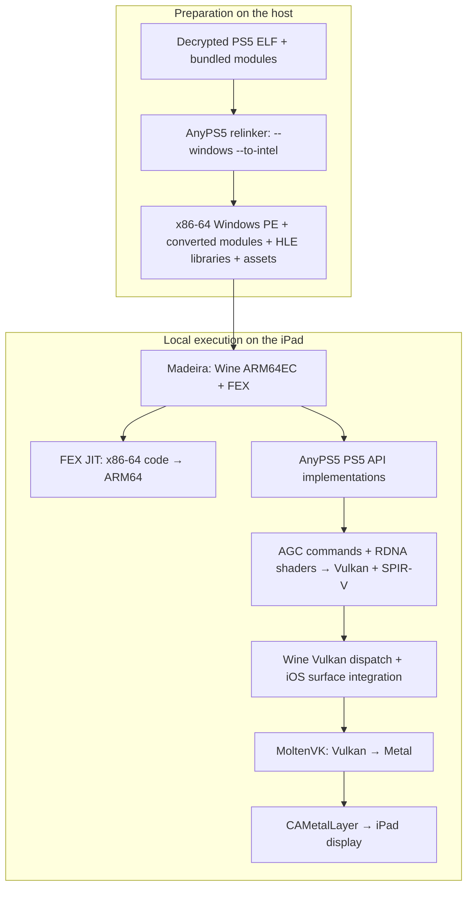

# madeira-anyps5

**Run relinked PS5 games locally on an iPad using AnyPS5, Madeira, Wine, FEX, and MoltenVK.**

AnyPS5 converts a decrypted PS5 executable ahead of time into an **x86-64 Windows PE** and supplies implementations of the PS5 APIs it uses. Madeira runs that Windows program on Apple Silicon: **Wine provides Windows services, FEX translates x86-64 CPU instructions to ARM64, and graphics follow Vulkan → MoltenVK → Metal**.

This repository contains the patches, build scripts, preparation tools, and device probes that connect those components. The app retains Madeira's library, settings, JIT setup, and touch controller. Games execute on the iPad; a PS5 or remote PC is not involved during play.

**Dreaming Sarah's PS5 build has reached touch-controlled gameplay on an iPad Air 13-inch M2.** This is an experimental compatibility stack with a limited tested library. See [device results](#device-results) for the distinction between gameplay observations, component tests, and the latest app build.

Runtime profiling is opt-in; the overlays distinguish Vulkan-reported presentation timing from accepted submissions. The runtime requests three swapchain images where supported, with a two-image comparison switch. See [runtime performance and measurement](docs/RUNTIME-PERFORMANCE.md) for switches, local tests and optimized host builds. A successful app build does not establish a speedup; matched physical-device measurements remain required.

## Execution architecture

There are two separate stages. Relinking happens before launch; CPU translation happens while the game runs.



### 1. AnyPS5: executable conversion and PS5 APIs

The input is the game's decrypted ELF executable and its bundled modules, rather than its source code or a PC version. The relinker writes a Windows PE with startup and dynamic-linking machinery, converts bundled modules, and checks the executable for unsupported syscall use. `--to-intel` rewrites supported AMD-specific instructions into a form suitable for the downstream x86-64 execution path. It does **not** compile the game into native ARM64 code.

PS5 system calls and library interfaces are handled by AnyPS5's replacement libraries, including `libkernel`, `libSceAgcDriver`, `libSceVideoOut`, `libScePad`, and the audio, user, dialog, and save APIs needed by the tested title. These are high-level API implementations, not PS5 firmware. Libraries with a `.prx` extension in the Windows runtime are host-built implementations; their filename alone does not make them original console binaries.

The PE wrapper does not change every guest function into a conventional Win64 function: the game retains PS5/SysV calling conventions. The relinker startup code, generated trampolines, and HLE builds must agree on those boundaries, thread-local storage, and exception unwinding.

PS5 imports identify functions through NIDs. The preparation tools NID-patch fresh HLE libraries and check the resulting import/export graph, including converted guest modules and Windows DLL dependencies. Resolving an import proves that a provider exists; it does not prove that every behavior required by a game is implemented.

The locally built HLE set now contains 50 PRX implementations. A prepared Unity/IL2CPP title resolves its 47 explicit HLE dependencies, but its iPad startup remains unqualified; an import-complete package is not proof of a playable game. [Local HLE builds](docs/LOCAL-HLE-BUILD.md) can also select all available PRX targets. The added [Unity-facing API coverage](docs/HLE-API-COVERAGE.md) includes functional local APIs and explicit offline/unsupported service paths. This is not an exhaustive PS5 API implementation or a compatibility guarantee for arbitrary games. See [AnyPS5's relinker usage](https://github.com/boykopovar/AnyPS5/blob/ee391a5614246338aec9cb7a3a3dd4f479aec9f3/docs/user/USAGE.md) and this repository's [game preparation guide](docs/PRIVATE-GAME-PACKAGING.md).

### 2. Wine and FEX: Windows services and CPU translation

Wine's ARM64EC runtime handles Windows executable loading, threading, files, exceptions, and virtual-memory APIs. FEX's `xtajit64.dll` translates the x86-64 guest code into ARM64 at runtime. These are complementary responsibilities: Wine supplies the operating-system interface; FEX supplies execution of the foreign CPU instructions.

The iOS build has two kinds of runtime components:

- **Windows PE modules**, including `xtajit64.dll`, `winevulkan.dll`, and `vulkan-1.dll`, packaged for Wine.
- **Native iPhoneOS static libraries**, containing Wine's Unix-side services and FEX support, linked into the app's Mach-O executable. Madeira's binder registers the Unix call tables instead of relying on desktop-style loading of Unix `.so` modules.

AVX/AVX2 support must be enabled in the actual `xtajit64` execution path before initialization with `MADEIRA_FEX_AVX=1`. Changing only Madeira's separate in-process FEX bridge is insufficient. On the tested Apple Silicon CPU, FEX lowers the relevant vector operations using its 128-bit host path; this does not require native 256-bit AVX or SVE hardware.

The build verifies the packaged ARM64EC PE components with [check-ios-pe.py](scripts/check-ios-pe.py). Required runtime libraries are real implementations, not empty archives used to make the linker succeed.

### 3. Graphics: PS5 commands to Metal

AnyPS5's graphics libraries interpret the game's AGC command stream, maintain GPU resources, and recompile RDNA shaders to SPIR-V. Their Vulkan calls cross this boundary:

```text
AnyPS5 libSceAgcDriver / libSceVideoOut
  → vulkan-1.dll → winevulkan.dll
  → registered iOS winevulkan Unix call table / win32u driver
  → statically linked MoltenVK
  → Metal command buffers and CAMetalLayer
```

The window path remains **SDL window → HWND → Wine surface → CAMetalLayer**. Wine translates the Win32 surface request into the Metal surface used by MoltenVK. The project does not replace VideoOut with a separate native Metal renderer, and this graphics path does not use Madeira's DXMT/D3D renderer.

The iOS integration builds `libwinevulkan_unix.a`, registers its dispatch table in Madeira's binder, and retains the statically linked MoltenVK entry points. The loader resolves Vulkan functions through valid dispatch entry points rather than passing an internal placeholder handle to ordinary `dlsym`.

The patches also handle Vulkan portability enumeration and enable the portability subset when advertised. Device capability checks remain meaningful: a successful Vulkan instance alone does not prove that shader execution, buffer device addresses, 8-bit storage, or BC textures work on the target iPad.

Two shader changes were necessary for the tested M2/MoltenVK path:

- **Invariant masked-shift folding:** prove that particular lane-query expressions are invariant, then remove their unnecessary subgroup operations. This addresses vertex-stage subgroup instructions that the device cannot support.
- **Validated fixed-function interpolation:** recognize supported RDNA interpolation sequences and emit a fixed-function equivalent, avoiding the unsupported barycentric path. `APS5_FIXED_FUNCTION_INTERPOLATION=1` explicitly selects this compatibility path; unrecognized sequences are rejected rather than silently approximated.

Game render targets, the SDL window, the Vulkan swapchain, and the Metal layer are separate dimensions. Dreaming Sarah diagnostics recorded **1280 × 720 game textures with a 768 × 432 swapchain**. A separate synthetic demo exercised a full 1280 × 720 surface. These results must not be conflated into a claim of native 720p output for every game run.

### 4. Guest memory and coherency

AnyPS5's original guest arena spans 448 GiB starting at an 8 GiB virtual address. An iPad's extended virtual-address entitlement does not make an equally large contiguous range available: Madeira, Wine, FEX, JIT aliases, and native mappings already occupy parts of the process address space.

The tested M2 configuration instead uses a **4 GiB virtual window at 464–468 GiB**, reserved lazily in **256 MiB chunks**. This is an address-space reservation policy, not an allocation of 4 GiB of physical RAM at startup.

The allocator accounts for existing host mappings and excludes conflicting chunks. A failed multi-chunk reservation rolls back newly acquired placeholders; a failed rollback is reported. Fixed-address conflicts are diagnosed rather than hidden by relocating mappings behind the guest's back.

Wine-side fixes preserve Windows placeholder replacement, shared 16 KiB mappings, protection changes, and write-watch behavior on iOS. Guest data mappings are distinguished from executable allocations so ordinary game memory does not exhaust FEX's JIT alias pool. PS5 memory uses 16 KiB pages, but Windows still exposes its own page and allocation-granularity semantics; matching the native page size alone is insufficient.

AnyPS5 tracks CPU writes to GPU-visible memory through page protection and dirty tracking. Native fault handling repairs the relevant writes while preserving shared aliases and subsequent GPU synchronization. Consecutive-fault diagnostics distinguish a stuck repeated fault from a long sequence of legitimate handled writes.

### 5. Input, JIT, and app lifecycle

Touch input follows **Madeira touch controller → XInput → SDL controller → `scePad`**. The app retains its 18-control layout. Early reservation of the virtual controller slot is available for titles that initialize SDL before the first touch; otherwise the game can miss the controller even while the native overlay responds.

JIT is required for FEX. Madeira retains its StikDebug and built-in StikJIT paths. The verified build-17 configuration uses **Settings → JIT method → Built-in StikJIT**, a pairing record stored in the app's Keychain, and an active LocalDevVPN connection. The helper enables debugging, prepares the JIT pool, and detaches before Wine starts. Automatic selection may choose an installed external helper, so the selected method and tunnel state matter.

The app needs a development signature and a provisioning profile that actually grants debugging, increased memory, and extended virtual addressing. Adding entitlement keys to the app without corresponding profile grants is insufficient.

The Vulkan lifecycle patch stops admitting new work when the app becomes inactive and drains submitted GPU work before suspension. A brief background/resume cycle has been observed to recover; long cycles remain a separate compatibility check. Audio runs through the AnyPS5/Wine runtime; music has been heard during gameplay, but complete audio behavior and save/load still need qualification.

## How this differs from Magnus

[MagnusPS5](https://github.com/BaconMakin/MagnusPS5) describes itself as an ARM/iOS PS5 emulator based on KyTyPS5. Its [runtime linker](https://github.com/BaconMakin/MagnusPS5/blob/main/src/loader/runtimeLinker.cpp) loads ELF programs and resolves them inside the emulator.

**madeira-anyps5 takes the ahead-of-time relinking route:** AnyPS5 prepares an x86-64 Windows program first; that program then runs through Wine + FEX, with graphics through Vulkan → MoltenVK → Metal. Executable conversion, PS5 API compatibility, CPU translation, and graphics translation remain distinct layers. This architectural difference is not a claim that either project is faster or supports more games.

## Device results

Evidence currently covers an **iPad Air 13-inch M2 (`iPad14,10`), iPadOS 27.0.1**. It does not establish compatibility with other models or OS versions.

| Test | Observed result |
| --- | --- |
| Dreaming Sarah, PS5 version `01.000.000` | Publisher logo, title/options, new game, visible forest gameplay, walking/jumping, music, and NPC dialogue in a maintainer recording. A separate six-minute run verified held directional input. [Recording notes](docs/evidence/ipad-m2-dreaming-sarah-gameplay-recording.json), [directional-input run](docs/evidence/ipad-m2-dreaming-sarah-held-input.json). |
| Earlier menu app, `0.1.8 (17)`, 2026-10-07 | Locally signed and installed as `com.buberlo.anyps5ipad`; its own library launch enabled JIT and reached the title screen with 18 controls. Gameplay, audio, save/load, and background recovery were not requalified on this exact build. [Build record](docs/evidence/ipad-m2-menu-build17.json). |
| Earlier menu app, `0.1.9 (18)`, 2026-10-07 | Refreshed native/ARM64EC runtime signed and installed; built-in StikJIT enabled after LocalDevVPN connected. The WASAPI hardware period reports 21.333 ms. The existing library/configuration were preserved. [Build and installation record](docs/evidence/ipad-m2-menu-build18-solitaire-install.json). |
| Earlier menu app, `0.1.9 (19)`, 2026-10-08 | Signed and installed with the UIKit-to-Vulkan activation gate repaired. Existing library and configuration are byte-preserved. [Build 19 record](docs/evidence/ipad-m2-menu-build19-solitaire-startup.json). |
| Earlier menu app, `0.1.9 (22)`, 2026-10-08 | Signed and installed with corrected ARM64 atomic fault classification. An independent CPU probe on the iPad verifies atomic write faults and a plain-load read-fault control. Library/configuration restored after testing. [Build 21 CPU record](docs/evidence/ipad-m2-menu-build21-atomic-direction.json). Build 22 adds default-quiet FEX configuration diagnostics; paired ordering tests still fault in Solitaire. [Build 22 record](docs/evidence/solitaire-build22-context-and-ordering.json). |
| Earlier menu app, `0.1.9 (23)`, 2026-10-08 | Signed and installed with an optional live guest argument tracer. The synthetic iPad probe passes ten calls, 210 pointer checks and R12–R15 preservation checks. The game still faults in its graphics worker; this is diagnostic progress, not compatibility proof. [Build 23 record](docs/evidence/solitaire-build23-live-arguments.json). |
| Earlier menu app, `0.1.9 (25)`, 2026-10-08 | Signed and installed with an FEX arithmetic frontend repair and opt-in block diagnostics. An independent x86 probe completes 160 result/flag checks on the iPad, but process cleanup still faults. Solitaire reaches its entry point in bounded prototype tests and still faults in its graphics worker. Production game files and configuration are restored. **No visible gameplay is qualified.** [Build 25 record](docs/evidence/solitaire-build25-arithmetic-checkpoint.json). |
| Earlier menu app, `0.1.9 (26)`, 2026-10-08 | Signed and installed with a fix for FEX memory notifications during DLL teardown. An independent native CRT write-fault test passes 36 data/register checks and 68 protected-page faults; the arithmetic test passes 160 checks. Both now exit with code 0 and return to the library. The controlled Solitaire test still faults at the same graphics-worker instruction. Production files and configuration restored. **No visible gameplay is qualified.** [Build 26 record](docs/evidence/solitaire-build26-native-write-and-teardown.json). |
| Current menu app, `0.1.9 (28)`, 2026-10-08 | Signed and installed with per-compiler IR capture ownership and preservation of the 128-byte SysV red zone during guest exception delivery. The independent red-zone test changes from four failures to zero. A separate private write-watch test passes 768 byte/register/reset checks, including four concurrent writers, exits 0 and returns to the library. Solitaire still faults with its normal memory tracking. A bounded private test without private write watching avoids that fault for 60 seconds but shows only white output and rejected GPU draws. All regular game files and configuration are restored; this switch is not a production fix. **No visible gameplay is qualified.** [Build 28 record](docs/evidence/solitaire-build28-redzone-and-write-watch.json). |
| Prepared shader repair, 2026-10-08 | A conservative scalar-branch optimization removes one unnecessary vertex subgroup vote. Fourteen complete private shader replays pass SPIR-V validation; synthetic branch tests and the rebuilt driver pass their host checks. The candidate is prepared locally and awaits an unlocked iPad for its controlled device test. **This is not visible gameplay proof.** [Qualification record](docs/evidence/solitaire-uniform-vertex-branch.json). |
| 15in1 Solitaire, PS5 version `01.000.000` | Installed and registered with 138 files verified by device hash readback and a complete HLE dependency audit. Production startup still needs Unity GC signal delivery (`sceKernelRaiseException`, `SIGUSR1`). A private cooperative prototype passes standalone target-thread/context/wait tests on iPad, but the game then fails in its graphics worker. Bounded stencil-clear and interpolation repairs now reach a visible game-selection menu in the native Windows comparison. The iPad experiment still faults in its graphics worker, and unsupported MSAA draws remain. The regular package and original configuration are restored and all 138 files rechecked in the app and by external device readback after the app-file service timed out. An untraced control still reads an invalid pointer (`0x2`) in the graphics worker. **No visible gameplay is qualified.** [Runtime checkpoint](docs/evidence/solitaire-discard-continuation-checkpoint.json). |
| CPU and HLE | Standalone AVX2 cases passed through Wine/FEX; an ELF processed by the actual relinker exercised real HLE calls, TLS, threads, and exceptions. [AVX2](docs/evidence/ipad-m2-wine-fex-cpu.json), [relinked CPU/HLE](docs/evidence/ipad-m2-relinked-hle-cpu-exceptions.json). |
| Memory | Exact reservation, collision refusal, placeholder replacement, write-watch, protection changes, shared aliases, and release passed in bounded probes. [Memory record](docs/evidence/ipad-m2-464gib-memory.json). |
| Graphics demo | A 600-second synthetic RDNA/VideoOut scene ran with a 1280 × 720 surface and exited successfully. This is a component/demo result, not a Dreaming Sarah benchmark. [Demo record](docs/evidence/ipad-m2-demo-720-ten-minute.json). |
| Lifecycle | A brief background cycle drained Vulkan work and resumed rendering. [Lifecycle record](docs/evidence/ipad-m2-vulkan-lifecycle-build13.json). |

**Stable displayed 60 FPS is not established.** The HUD distinguishes Vulkan-reported presentation timing from successful present calls. The pinned MoltenVK may substitute a completion clock when a Metal presentation timestamp is missing, so neither counter alone proves unique displayed game frames. A reported 60.0 reading after requesting three swapchain images motivates the current candidate; it does not replace matched, sustained gameplay measurements. Long-session stability, full background recovery, save/load, and broader game compatibility remain open.

## Build and prepare a game

Builds are manual and local. GitHub Actions is disabled, and there is no published installable IPA. Use fresh submodule checkouts and the recorded pins; mixing binaries or patches from different runtime revisions can break ABI and memory assumptions.

### Prepare the source and host tools

On an Apple Silicon Mac with Xcode, CMake, Ninja, and a C++20 compiler:

```sh
git clone https://github.com/buberlo/madeira-anyps5.git
cd madeira-anyps5
scripts/apply-patches.sh
scripts/build-host-relinker.sh
```

This builds only the portable relinker and NID patcher. It does not build Windows HLE libraries or execute a game.

### Build the Windows HLE runtime

In a separate checkout on Windows, use Git Bash with Python 3, CMake, Ninja, LLVM's ELF tools, and 7-Zip available:

```sh
scripts/windows-runtime-build.sh
```

The script applies the patches, builds the selected AnyPS5 libraries and probes, and exports `build/windows-runtime-artifact/hle-runtime.zip`. The archive contains unpatched HLE libraries, compiler runtime DLLs, and a hash manifest; it contains no game data. Its build-time tests do not replace runtime tests on a Windows Vulkan GPU or an iPad.

The qualified HLE compiler is **WinLibs GCC 15.2.0, posix-SEH, UCRT r7**, downloaded and hash-checked by [m0-build-anyps5-winlibs.sh](scripts/m0-build-anyps5-winlibs.sh). The SysV calling convention and exception/unwind path are toolchain-sensitive; an arbitrary MinGW or Clang build is not an equivalent replacement.

### Prepare your decrypted dump

Copy the HLE archive to the same local path on the preparation host, then run:

```sh
python3 scripts/prepare-private-game.py \
    --dump /path/to/your/decrypted-app0 \
    --hle build/windows-runtime-artifact/hle-runtime.zip \
    --output build/private-game
```

The tools leave the originals unchanged, relink the executable and bundled modules, copy assets, patch fresh HLE copies, and audit dependencies. The output has `game.exe`, `libs/`, `app0/`, and `private-game-manifest.json` with file hashes and tool provenance.

`prepared_unexecuted` means static preparation passed. Missing dependencies produce `not_ready_missing_dependencies` and exit code 2; no empty replacement library is fabricated. Preparation currently happens on the host, rather than through a raw-dump importer inside the iPad app. See [private game preparation](docs/PRIVATE-GAME-PACKAGING.md) for the detailed input rules.

### Build the iPad app

The app build additionally requires Rust/Cargo, LLVM binary tools, the Wine build dependencies, and a static **iPhoneOS ARM64 MoltenVK** archive. Select Xcode explicitly and build MoltenVK from its pinned checkout:

```sh
export DEVELOPER_DIR=/Applications/Xcode.app/Contents/Developer
git submodule update --init upstreams/MoltenVK
(
    cd upstreams/MoltenVK
    ./fetchDependencies --ios
    make ios
)
scripts/m3-madeira-ios.sh
```

[m3-madeira-ios.sh](scripts/m3-madeira-ios.sh) builds the native FEX/Wine pieces, packages the ARM64EC PE modules, links the Vulkan integration, and checks the app and JIT helper. The default is an unsigned build at `build/ios-runtime/DerivedData/Build/Products/Debug-iphoneos/Madeira.app`. It retains the tested Debug host/JIT configuration while compiling major runtime components with their release settings.

For a signed device build, configure your Xcode account and a suitable provisioning profile, then run:

```sh
APS5_CODE_SIGNING=YES APS5_DEVELOPMENT_TEAM=YOUR_TEAM_ID \
    scripts/m3-madeira-ios.sh
```

`APS5_MOLTENVK_LIBRARY` can select another matching iPhoneOS archive. `APS5_ALLOW_PROVISIONING_UPDATES=1` allows Xcode to update provisioning. Neither setting substitutes for the required entitlements. Building does not install the app, import the private package into its container, pair the JIT helper, or prove gameplay.

## Runtime configuration

The app seeds an AnyPS5 profile once and preserves subsequent user settings. These are configuration values, not performance measurements. In `madeira.cfg`, runtime environment entries use the form `env.NAME = value`.

| Setting | Tested value / purpose |
| --- | --- |
| `env.MADEIRA_FEX_AVX` | `1`: enable the AVX/AVX2 execution path before FEX initialization. |
| `env.APS5_GUEST_ARENA_LAZY` | `1`: reserve guest addresses on demand. |
| `env.APS5_GUEST_ARENA_BASE` | `0x7400000000`: 464 GiB virtual base for the tested M2 layout. |
| `env.APS5_GUEST_ARENA_SIZE` | `0x100000000`: 4 GiB virtual window. |
| `env.APS5_GUEST_ARENA_CHUNK` | `0x10000000`: 256 MiB reservation chunks. |
| `env.MADEIRA_CONTROLS_XBOX_DEFAULT` | `1`: seed the Xbox-style touch layout. |
| `env.MADEIRA_PAD_EARLY_SLOT` | `1`: reserve the virtual controller before SDL initialization when needed; restart the app after changing it. |
| `env.APS5_FIXED_FUNCTION_INTERPOLATION` | `1` in the tested Dreaming Sarah profile; a specific shader compatibility option, not a universal game default. |
| `env.MADEIRA_FRAMEGEN` | `0`: frame generation disabled. |
| `d3d12` | `0`: use this Vulkan path rather than D3D12. |

The build uses `APS5_VULKAN_ONLY=1`, `MADEIRA_WITH_VULKAN=1`, and `MADEIRA_VK_STATIC_LINK=1`. Those build switches are distinct from the game-session environment above.

## Source layout and technical records

| Path | Contents |
| --- | --- |
| `upstreams/` | Pinned AnyPS5, Madeira, FEX, Wine, and MoltenVK submodules. |
| `patches/` | Separate patch series for each upstream. |
| `scripts/` | Build entry points, private preparation, packaging, and runtime integration. |
| `tools/` | CPU, memory, graphics, shader, and packaging probes. |
| `docs/evidence/` | Structured test results with scope, hashes, and limitations; private dumps and raw shader captures are excluded. |

[Implementation records](docs/IMPLEMENTATION.md) document the port's repairs and experiments. [Upstream pins](docs/UPSTREAMS.md) identify the exact source revisions. [Milestones](docs/MILESTONES.md) and [early patch notes](docs/PATCHES.md) describe historical foundation work, not the current build status.

## Credits

- [AnyPS5](https://github.com/boykopovar/AnyPS5), by boykopovar: relinker, PS5 API implementations, RDNA shader recompiler, and Vulkan renderer.
- [Madeira](https://github.com/willfaust/Madeira), by Will Faust: iOS host, Wine ARM64EC integration, JIT setup, and controller UI.
- [FEX](https://github.com/FEX-Emu/FEX), using [willfaust's iOS port](https://github.com/willfaust/FEX): x86-64 to ARM64 translation.
- [Wine](https://www.winehq.org/), using [willfaust's Madeira branch](https://github.com/willfaust/wine): Windows compatibility.
- [MoltenVK](https://github.com/KhronosGroup/MoltenVK): Vulkan implementation over Metal.
- [StikDebug](https://github.com/StikDebug/StikDebug) and [StikJIT](https://github.com/StikDebug/StikJIT): JIT activation.

The repository contains no games, extracted game assets, decryption keys, proprietary SDK libraries, or PS5 firmware. Supply your own lawfully obtained decrypted dump. Private game packages and pairing material stay outside Git. The project is not affiliated with Sony Interactive Entertainment or Apple.

The original [buberlo/anyps5-ipad](https://github.com/buberlo/anyps5-ipad) URL redirects to this repository.

## License

Copyright (C) 2026 buberlo. The files written for this project are under the GNU General Public License, version 2 or (at your option) any later version. The text is [LICENSE](LICENSE). That covers `scripts/`, `tools/`, `docs/`, and the other files outside `patches/` and `upstreams/`, except a file that carries its own `SPDX-License-Identifier` line.

`patches/<name>/` is a derivative work of that upstream and keeps the upstream license. Pinning a submodule does not relicense it. Upstream projects keep their own licenses.

| Series | License of the patches |
| --- | --- |
| `patches/anyps5/` | GPL-2.0-only |
| `patches/madeira/` | GPL-3.0-or-later |
| `patches/fex/` | GPL-3.0-or-later |
| `patches/wine/` | LGPL-2.1-or-later |
| `patches/moltenvk/` | no source patches |

AnyPS5's README at the pinned commit states "version 2 only", so those patches cannot be relicensed to GPL-3.0. Madeira is GPL-3.0-or-later, so its patches cannot be relicensed to GPL-2.0-only. GPL-2.0-or-later is the copyleft that can travel with either build: convey these scripts under GPL-2.0 with an AnyPS5 binary, or under GPL-3.0 with the iPad app.

The iPad Mach-O is a Madeira derivative. It statically links Wine (LGPL-2.1-or-later), FEX (upstream MIT, Madeira's modifications GPL-3.0-or-later), and MoltenVK (Apache-2.0). That combination is conveyed under GPL-3.0-or-later, and the LGPL obligations for Wine stay in force. AnyPS5 is a separate GPL-2.0-only program. Wine loads the relinker output and the HLE libraries as Windows modules. Keep that GPL-2.0-only code in its own program. The Mach-O that statically links Apache-2.0 MoltenVK is the GPL-3.0 app.

The per-upstream findings, pins, and the files that stay MIT are in [NOTICE](NOTICE). Distribution rules are in [docs/LEGAL.md](docs/LEGAL.md).
