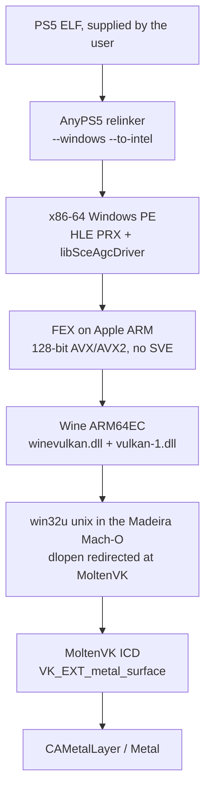

# Architecture

AnyPS5 and Madeira stay separate programs. AnyPS5 relinks a PS5 ELF into a
Windows PE. Madeira, on the iPad, is the process that loads that PE. Nothing
in this repository links the two codebases into one binary. That split is also
a license boundary: AnyPS5 is GPL-2.0-only and Madeira is GPL-3.0-or-later.
See [LEGAL.md](LEGAL.md).

## What each stage actually does

**AnyPS5** (`boykopovar/AnyPS5`) reads a PS5 ELF and writes a native executable.
The default target is a Linux ELF. `--windows` writes a Windows PE.
`--to-intel` rewrites AMD64 instructions the project does not want to keep
into sequences an Intel-like decoder accepts. HLE implementations of PS5
PRX libraries live under `core/libs/prx/`. The GPU path is
`libSceAgcDriver`: guest shaders are recompiled to SPIR-V and submitted to
Vulkan. On Windows the loader opens `vulkan-1.dll`. On Linux it opens
`libvulkan.so.1`.

**Guest addresses.** The Windows build reserves one VA arena for guest
mappings (`GuestArena.cpp`). The default span is base `0x200000000` (8 GiB)
and size `0x7000000000` (448 GiB), with a hole from `0x7FFFFC000` to
`0x1000000000` marked used so the allocator does not hand it out. The Linux
host build does not reserve that arena: the constructor body is under
`#ifdef _WIN32`, so `GuestArenaAvailable` stays false and the Linux heap path
is used instead. The iPad runs the Windows PE, so it hits the Windows arena.

**Page size.** `PS5_PAGE_SIZE` is `0x4000` (16 KiB) in
`core/libs/prx/libkernel/DirectMemory/DirectMemory.hpp`. Madeira's
`FEXBridge.mm` uses the same `JIT_PAGE_SIZE`. That match is real; it does
not by itself make the arena fit.

**FEX** (official `FEX-2610`, with the reconciled Madeira iOS port in
`patches/fex/`) translates the PE's x86-64
code. Apple A-series and M-series cores have NEON and do not implement SVE.
In this tree `GetGuestVectorLength()` returns 256-bit only when both
`SupportsAVX` and `SupportsSVE256` are set. With SVE off, AVX and AVX2 stay
on the 128-bit IR path, which lowers onto NEON. SVE is not a prerequisite
for enabling `SupportsAVX`. It is the fast path for full-width YMM ops.
A standalone x64 AVX2 probe has passed through Wine/FEX on the M2 iPad.
That probe is not a measurement of every PS5 AVX2 sequence on the 128-bit
split. See [IMPLEMENTATION.md](IMPLEMENTATION.md).

Madeira has two FEXCore copies:

- `app/Madeira/FEXBridge.mm` builds a `HostFeatures` struct by hand for the
  in-process bridge. Upstream hardcodes `SupportsAVX = false` with the
  comment "No SVE on A15". The patch in this repo reads `MADEIRA_FEX_AVX`
  and defaults to on (`=0` turns it off).
- `FEX/Source/Windows/Common/CPUFeatures.cpp` is the ARM64EC module that
  actually runs games (`xtajit64`). It already defaults AVX off and turns it
  on when `MADEIRA_FEX_AVX=1`. The library UI exports that variable. A PS5
  title has to set it, or the first VEX instruction faults. The bridge patch
  does not change that default.

**Wine** (`willfaust/wine`, branch `madeira-lgpl`) is Wine 11 built as
ARM64EC. Madeira does not run a wineserver plus unix `.so` files the way
desktop Wine does. `ntdll` and `win32u` unix sides are compiled with the iOS
SDK and archived into the app (`build/ntdll-unix`, `build/win32u-unix`).
Upstream Madeira configures the i386 PE farm `--without-vulkan`, and
`config_ios.h` `#undef`s `SONAME_LIBVULKAN`, so an unpatched
`vulkan_init_once` logs that Wine was built without Vulkan and returns.
D3D 9–12 go through DXMT and `madeira-d3d12` to Metal. AnyPS5 does not speak
D3D. It speaks Vulkan. The patches in this tree build the iOS `winevulkan`
unix archive and connect it to MoltenVK. That is the path that presents the
PS5 build on the M2 iPad.

The load path:

1. The PE calls `SDL_LoadObject("vulkan-1.dll")`.
2. Wine's `vulkan-1.dll` forwards into `winevulkan.dll`.
3. `winevulkan` calls `__wine_get_vulkan_driver` in `win32u`.
4. `dlls/win32u/vulkan.c` `dlopen`s `SONAME_LIBVULKAN` and `dlsym`s
   `vkGetInstanceProcAddr` and `vkGetDeviceProcAddr`.
5. The user driver `pVulkanInit` creates the surface. Unpatched Madeira
   leaves that slot empty, so it falls through to `nulldrv_VulkanInit`
   (`STATUS_NOT_IMPLEMENTED`) and a headless surface. The patch fills it.

The patch compiles `vulkan.c` with `SONAME_LIBVULKAN` defined as `"MoltenVK"`
and points `dlopen` at `moltenvk_static_loader.c`. That tries a real
`dlopen` first, then binds the statically linked MoltenVK entry points.
`vulkan_metal_ios.c` implements `winios_pVulkanInit`: it maps
`VK_KHR_win32_surface` to `VK_EXT_metal_surface` and creates the surface
from the `CAMetalLayer` `Winios.m` already keeps for the HWND
(`winios_metal_layer_for_hwnd`).

**MoltenVK** is the Vulkan ICD on top of Metal. Two integration facts are
not optional on that ICD, and stock AnyPS5 does neither:

- Instances must set `VK_INSTANCE_CREATE_ENUMERATE_PORTABILITY_BIT_KHR` and
  enable `VK_KHR_portability_enumeration`, or MoltenVK devices stay hidden.
- If the device advertises `VK_KHR_portability_subset`, `vkCreateDevice`
  fails unless that extension is enabled.

`patches/anyps5/legacy-6e037e98/0002-vulkan-portability.patch` does both, only when the
extension is advertised, so a full ICD is unchanged. The capability tool
prints `stock-anyps5-device-count` and `portability-device-count` so a later
Mac or iPad run can see the gap directly. If stock `vkCreateInstance`
fails and `VK_KHR_portability_enumeration` is advertised, the tool
records a stock count of 0 and continues with the portability instance.
On the `macos-15` runner that gap is 0 versus 1, and the portability
device passed every hard check.

**Entitlement.** Madeira's `EntitlementChecker.swift` records a measured map
ending at `0xfc0000000` (63 GB) without
`com.apple.developer.kernel.extended-virtual-addressing`, and a 512 GB map
with it. `app/source.json` already lists the entitlement.
`Madeira.entitlements` did not. The 448 GiB arena ends at `0x7200000000`
(456 GiB), which is inside a 512 GB map and outside a 63 GB map. The plist
key is necessary and not sufficient: the provisioning profile has to grant
it, and iOS may still refuse a single 448 GiB `MEM_RESERVE`. Lazy chunks
(`APS5_GUEST_ARENA_LAZY=1`) are the other half of that.

## What is not in this picture

DXMT, `madeira-d3d12`, and the nested `dxmt` / `madeira-dock` submodules are
Madeira's D3D path. They are not initialized here. StikDebug/StikJIT is how
Madeira gets JIT on iOS; this repo does not vendor it. No PS5 firmware, keys,
or title data are part of the chain we ship.
